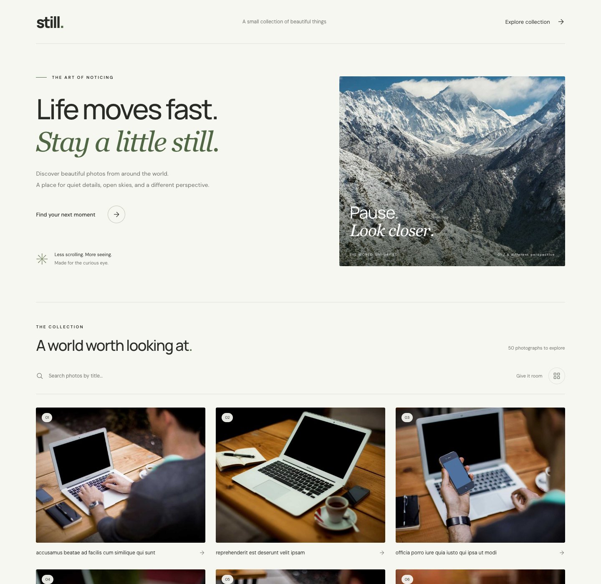
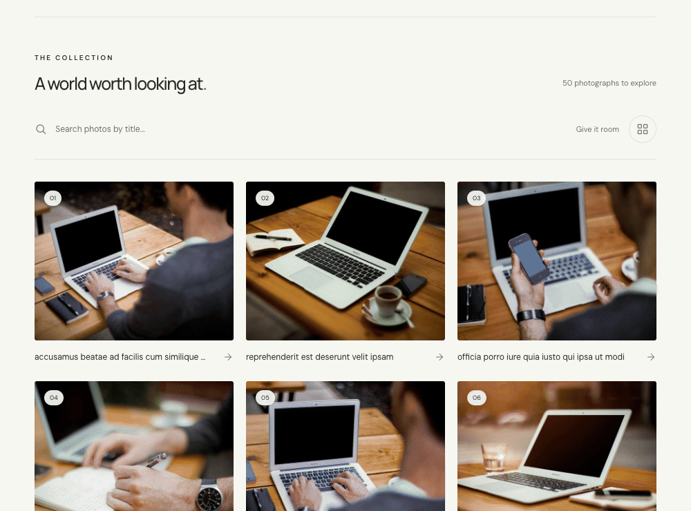
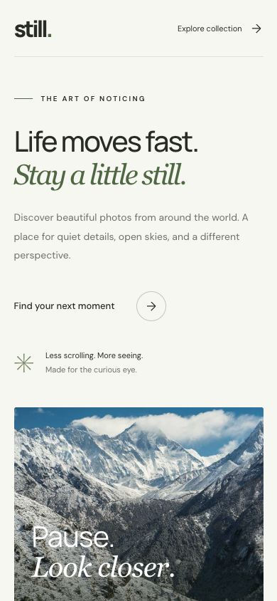

# still.

**A quiet photo gallery for curious eyes.**

Beautiful photographs, thoughtful typography, and just enough motion. Browse the collection, search for a title, and open a photograph to see a little more.



## Look closer



- **Find your moment.** Instant, case-insensitive search with highlighted matches and a one-click reset.
- **Give it room.** Switch between a compact collection and a spacious grid.
- **Stay in the picture.** Open the lightbox, explore with `←` / `→`, and close with `Esc`.
- **Feel the details.** Gentle reveals, slow image zooms, and clean transitions. Reduced-motion preferences are respected.
- **Take it anywhere.** Responsive layouts, keyboard controls, visible focus, and useful loading, empty, and error states.

## Run locally

Use **Node.js 24 LTS** (or Node.js 22.13+).

```bash
git clone git@github.com:leracherry/photo-gallery.git
cd photo-gallery
npm ci
npm run dev
```

Open the local URL printed by Vite. No API keys or environment variables required.

## Development

| Command                | Purpose                                 |
| ---------------------- | --------------------------------------- |
| `npm run dev`          | Start the development server            |
| `npm run build`        | Build the production app into `dist/`   |
| `npm run preview`      | Preview the production build            |
| `npm test`             | Run the component and interaction tests |
| `npm run test:watch`   | Run tests as you work                   |
| `npm run test:ui`      | Open the interactive test dashboard     |
| `npm run lint`         | Check JavaScript and React rules        |
| `npm run format:check` | Check formatting                        |
| `npm run format`       | Apply formatting                        |

## Small by design

**React · Vite · Plain CSS · Vitest · Testing Library**

```text
src/
├── App.jsx                 Collection, fetching, and search state
├── App.css                 Layout, visual design, and motion
├── components/
│   ├── PhotoList.jsx       Responsive cards and image fallbacks
│   ├── SearchBar.jsx       Search and reset controls
│   ├── Lightbox.jsx        Accessible photograph viewer
│   └── Icon.jsx            Lightweight SVG icons
├── utils/highlight.jsx     Safe, literal search highlighting
└── tests/                  Component and user journey tests
```

Photo titles come from [JSONPlaceholder](https://jsonplaceholder.typicode.com/); photographs come from [Lorem Picsum](https://picsum.photos/). Titles are demo data, not descriptions of the images. The hero uses a fixed Picsum photograph, and each gallery thumbnail shares an image ID with its full-size version. Fonts are served by Google Fonts with local fallbacks.

An internet connection is needed for the demo data, photographs, and web fonts. Failed collection requests show a retry action; unavailable images have a readable fallback.

<details>
<summary>See the mobile layout</summary>
<br />

</details>

---

_Less scrolling. More seeing._
